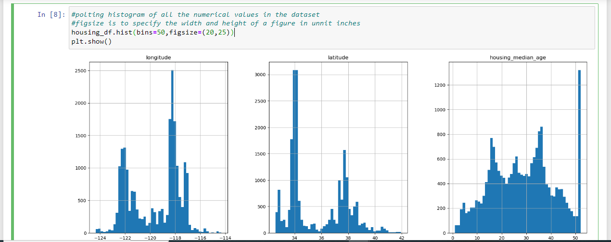
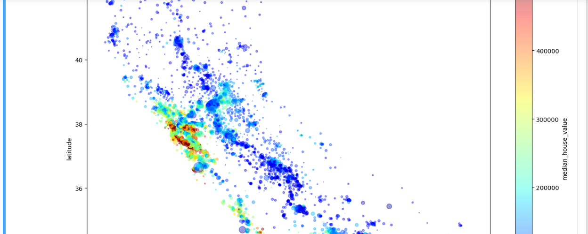
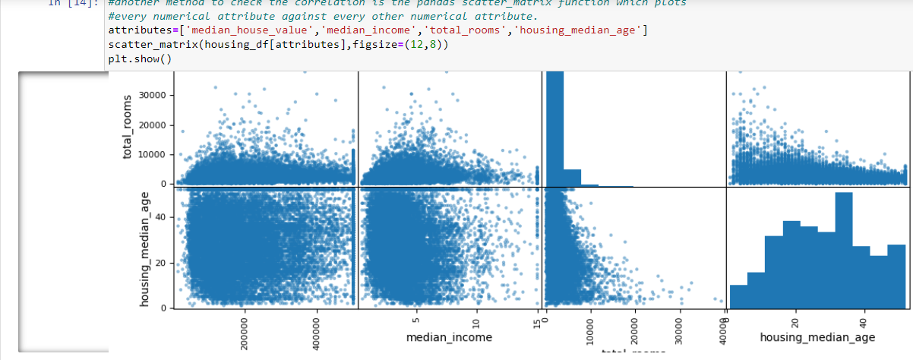

# Housing-price-prediction

## Description
This repository contains code and resources for a housing price prediction project. The project aims to train a model that predict median housing price based on various features. The repository includes exploratory data analysis (EDA) and different models for predicting housing prices.

## Dataset
The dataset used for this project can be found at `dataset`. It contains information about various houses including features such as location, size, number of rooms, etc., along with their corresponding prices. The dataset has been preprocessed and cleaned for further analysis.

## Exploratory Data Analysis
The EDA notebook can be found at project notebooks/EDA.ipynb. It provides a detailed analysis of the dataset, including data visualization, statistical summaries, and insights about the various features that influence housing prices. The notebook helps in understanding the data distribution and identifying potential patterns.

## Setup
Load `requirements.txt` file.It contains all the libraries required for this project.
Matplotlib is a comprehensive library for creating static, animated, and interactive visualizations in Python.
## Usage
To use the project for housing price prediction, follow these steps:

1.Ensure you have installed the required dependencies mentioned in the Installation section.

2.Run the EDA notebook notebooks/EDA.ipynb to understand the dataset and gain insights.

3.Open the corresponding Python file for the other trained models and run it. Modify the file as per your requirements, such as feature selection, hyperparameter tuning, etc.

4.Once the model is trained, you can use it to predict housing prices by providing relevant input data.

## Contributing
Contributions to this repository are welcome! If you have any ideas, suggestions, or bug fixes, please open an issue or submit a pull request. Make sure to follow the existing code style and add appropriate tests for your changes.

## Author
Penina Pendo

